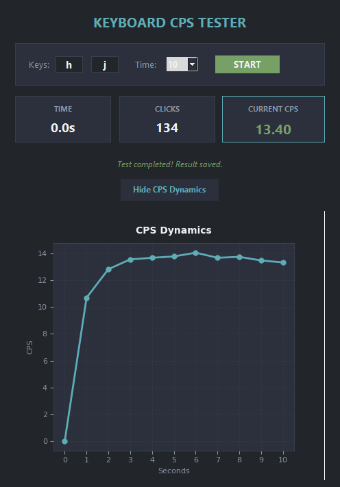

# Keyboard CPS Tester

<p align="center">
  
</p>


## 🚀 Installation & Setup

### Prerequisites

* **Python 3.8+**

### 1. Clone the Repository

```bash
git clone https://github.com/yourusername/keyboard-cps-tester.git
cd keyboard-cps-tester

```

### 2. Install Dependencies

```bash
pip install matplotlib pyinstaller

```

### 3. Run the Application

```bash
python main.py

```

---

## 🕹️ Usage Guide

1. Enter two target keys in the **Keys** input fields.
2. Select the test duration from the **Time** dropdown.
3. Click **START**.
4. Press the selected keys.
5. Click **Show CPS Dynamics** after the test completes to view the graph.

---

## 📦 Building to Executable (.exe)

Run the following command in your terminal to compile the script into a single executable file without a console window:

```bash
pip install pyinstaller
python -m PyInstaller --onefile --noconsole main.py

```

> **Note:** The compiled binary will be located in the `dist/` directory.
